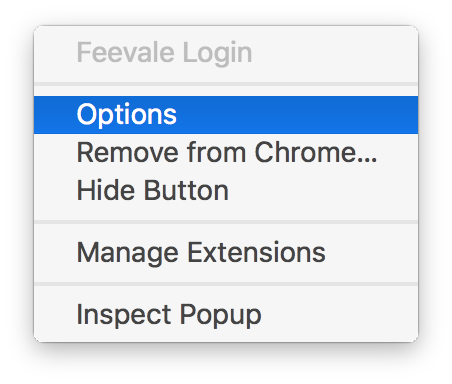
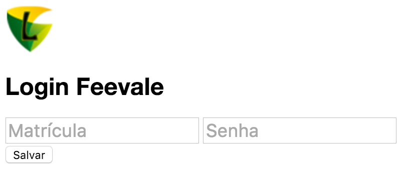
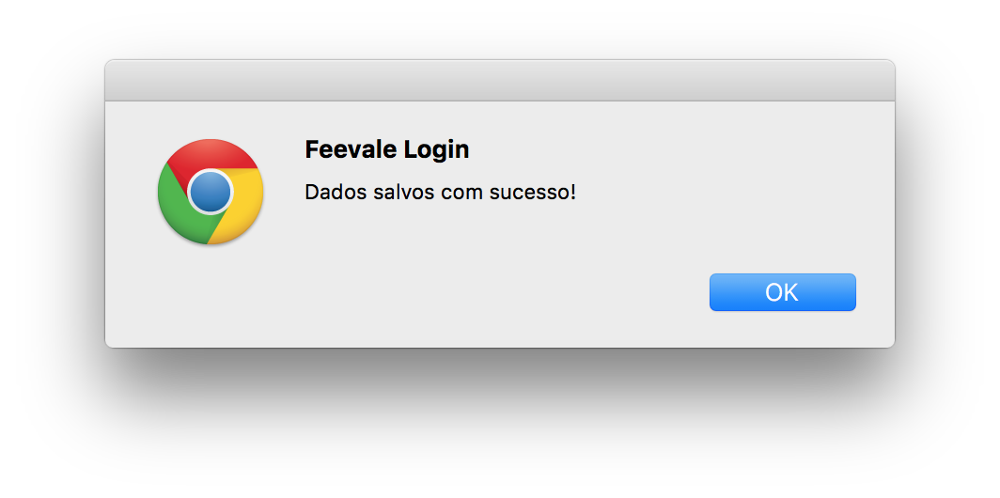

#  Feevale Login
*Extensão para o [Google Chrome](https://www.google.com.br/chrome/) afim de realizar login na rede interna da [Universidade Feevale](http://www.feevale.br/).*

## Esclarecimentos
- As informações de usuário e senha para realizar a autenticação não são enviadas a local algum, elas permanecem guardadas no próprio Google Chrome;
- Para realizar o login, a extensão abre uma nova aba no navegador e após, fornece a página de autenticação os dados informados pelo usuário afim de realizar a autenticação, ou seja, esta extensão serve apenas para executar o login de forma automatizada;

## Como executar o projeto?
#### Clone o repositório
```
git clone https://github.com/romuloalves/feevale-login.git
```

#### Instale as dependências
```
npm install
```

#### Execução da extensão
Siga os passos existentes na página do próprio Google sobre como carregar uma extensão em modo de desenvolvedor, utilizando o diretório `src`:
[https://developer.chrome.com/extensions/getstarted#unpacked](https://developer.chrome.com/extensions/getstarted#unpacked)

#### Gere o arquivo .zip para deploy na [Chrome Web Store](https://chrome.google.com/webstore/)
```
gulp deploy
```

## Como inserir seus dados
#### Clique com o botão direito do mouse na extensão e clica na opção `Opções` ou `Options`.


#### Na página que foi aberta, insira seus dados e clique em `Salvar`


#### Após a mensagem de sucesso, imagem abaixo, é somente fechar a aba de opções e passar a utilizar a extensão clicando no ícone com o botão esquerdo do mouse

